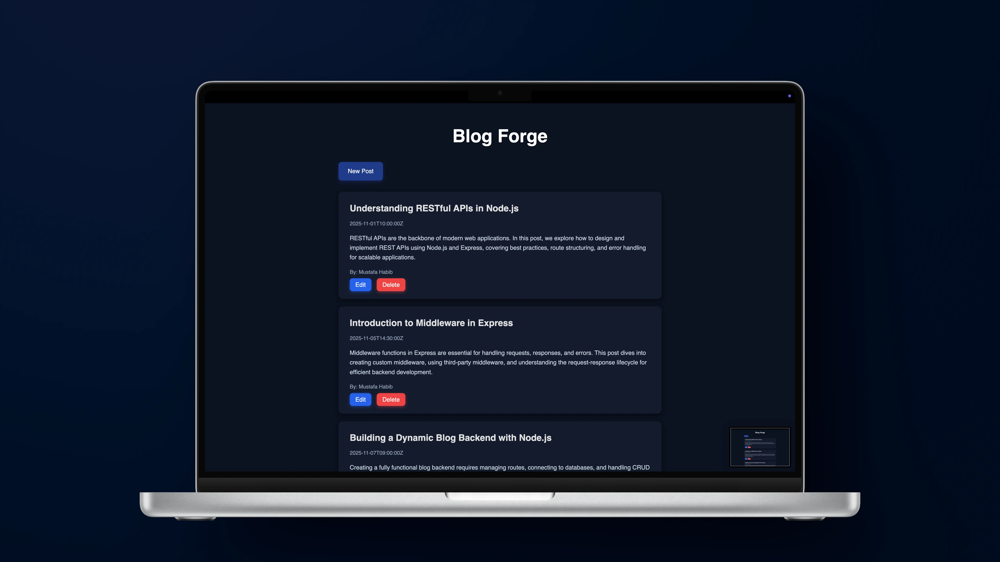

# Blog Forge

Full-stack blog application built with **Node.js**, **Express**, and **EJS**, allowing users to create, edit, and delete blog posts dynamically through a RESTful API backend and a responsive frontend.

<p align="center">
  
</p>

<br>

---

## Tech Stack

- **Backend:** Node.js, Express
- **Templating:** EJS
- **Styling:** CSS
- **Middleware:** body-parser
- **Data:** JSON (in-memory posts via `index.js`)

<br>

---

## Features

- Create, edit, and delete blog posts in real-time.
- Dynamic rendering of posts using **EJS templates**.
- Structured post data stored in **JSON** in `index.js`.
- Responsive and modern UI with card-style posts, intuitive forms, and buttons.

<br>

---

## Requirements

- **Node.js** (v14 or higher recommended)
- **npm** (comes with Node.js)
- A modern web browser (Chrome, Firefox, Edge, etc.)

> **! Important:** Both `server.js` and `index.js` must be running for the application to work properly.  
> `server.js` serves the UI, while `index.js` handles the posts API.

<br>

---

## How to Use

1. Start the backend API server:

```bash
node index.js
```

2. Start the frontend server:

```bash
node server.js
```

3. Open your browser at:

```
http://localhost:3000
```

4. Create a new post by clicking **New Post**.
5. Edit or delete posts using the corresponding buttons on each post card.
6. Posts will dynamically update through the RESTful API.

<br>

---

## Installation

1. Clone the repository:

```bash
git clone https://github.com/MustafaHabibX/blog-forge.git
```

2. Navigate to the project folder:

```bash
cd blog-forge
```

3. Install dependencies:

```bash
npm install
```

4. Start both servers:

```bash
node index.js
node server.js
```

5. Open your browser at:

```
http://localhost:3000
```

<br>

---

## Learning Outcomes

- Gained hands-on experience with **Node.js** and **Express** for backend development.
- Learned to use **EJS templates** for dynamic frontend rendering.
- Practiced building a **RESTful API** for CRUD operations.
- Implemented **form handling** and routing for user interactions.
- Developed skills in creating a **modern, responsive UI** using HTML and CSS.
- Strengthened understanding of **full-stack JavaScript application structure** and workflow.

<br>
